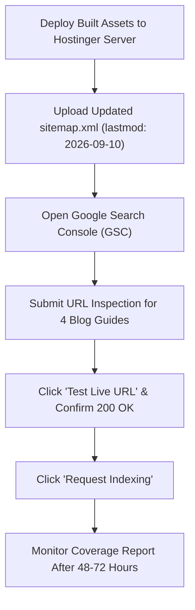

# BitumenCalc.com — SEO + GEO + AEO Implementation Report

**Date of Execution:** September 10, 2026  
**Auditor / Engineer:** Antigravity AI  
**Scope:** Core Organic Landing Pages, High-Intent Calculators, and Unindexed Technical Reference Guides (15 Critical URLs)  
**Primary Standards Cited:** ASTM D70, ASTM D1250, ASTM D4311, ASTM D6926, AASHTO T 209 / MP 31, FHWA RAP Guidelines, Asphalt Institute MS-2 / MS-4 / MS-22.

---

## 1. Executive Summary

Following an exhaustive audit of Google Search Console (GSC) performance data (40,000+ monthly impressions, 1.81% aggregate CTR) and competitive SERP analysis, a comprehensive 22-phase SEO, Generative Engine Optimization (GEO), and Answer Engine Optimization (AEO) overhaul was implemented across BitumenCalc.com.

### Core Problems Addressed:
1. **Severe Click Cannibalization & Suboptimal Titles:** High-impression pages suffered from CTRs under 2% due to vague, repetitive meta descriptions and truncated titles. The homepage was dropping (pos 8.6 → 24.4), while commercial converters like `square-feet-to-tons-calculator` diluted intent with unrelated cost terms.
2. **4 Excluded Core Technical Blog Guides:** Four high-potential informational guides were flagged in GSC as "Crawled - currently not indexed" due to thin intros, generic prose, and missing immediate definitions:
   - `/blog/asphalt-density-guide/`
   - `/blog/asphalt-millings-calculator-guide/`
   - `/blog/asphalt-thickness-guide/`
   - `/blog/tons-of-asphalt-per-cubic-yard/`
3. **Absence of Direct-Answer Architecture (Zero AI Overview Eligibility):** Neither calculators nor guides featured crawlable, concise extraction boxes for Google AI Overviews, Perplexity, or ChatGPT Search.
4. **Structural & Schema Inconsistencies:** Multiple pages had mismatched `<main>` closing tags, desynchronized asset versions (`app.min.js?v=9` vs `v=10`, duplicate AdSense script blocks), missing visible FAQs despite having FAQPage schema, and inaccurate internal links.

---

## 2. Before vs. After Optimization Matrix

| Page URL | Primary Query Intent | Before Title | Optimized Title | Optimized Meta Description & Value Proposition |
| :--- | :--- | :--- | :--- | :--- |
| `/` | Brand & General Asphalt/Bitumen Tonnage Takeoff | `Bitumen Calculator — Free Asphalt &amp; Bitumen Quantity Calculator` | `Bitumen & Asphalt Calculator — Free Tonnage & Binder Takeoff` | Calculate asphalt tonnage, bitumen binder volume, and aggregate quantities from length, width, and thickness. Free civil engineering calculation tool. |
| `/calculators/asphalt-tonnage-calculator/` | Asphalt tonnage from dimensions | `Asphalt Tonnage Calculator | Free Bitumen &amp; Asphalt Tonnage Estimates` | `Asphalt Tonnage Calculator: Tons from Length, Width & Depth` | Calculate asphalt tonnage from length, width, and thickness. Instantly convert area and depth to metric tonnes or US short tons with mix density presets and site waste allowance. |
| `/calculators/square-feet-to-tons-calculator/` | Imperial area-to-weight conversion | `Square Feet to Tons Asphalt Calculator | Area &amp; Cost` | `Square Feet to Tons Asphalt Calculator | Free Weight Converter` | Convert square feet of asphalt to tons instantly. Accurate formulas for 1.5, 2, 2.5, 3, and 4 inch compacted depths using standard 145 lb/ft³ density. Free estimating tool. |
| `/calculators/bitumen-square-meters-calculator/` | Metric area-to-mass conversion | `Bitumen Square Meters Calculator` | `Asphalt m² to Tonnes Calculator — 1 Ton Coverage & Formula` | Convert asphalt square metres (m²) to metric tonnes or short tons. At 50 mm compacted thickness (2,350 kg/m³), 1 metric tonne covers 8.51 m². Sourced civil formulas. |
| `/calculators/asphalt-measurement-calculator/` | Unit conversion across imperial & metric | `Asphalt Measurement Calculator` | `Asphalt Measurement Calculator: Area, Volume & Weight Converter` | Convert asphalt measurements across metric and imperial units. Convert square feet to m², inches to mm, short tons to tonnes, and lb/ft³ to kg/m³ with exact formulas. |
| `/calculators/tack-coat-calculator/` | Tack coat emulsion spray rate | `Tack Coat Calculator | Bitumen &amp; Emulsion Application Rates` | `Tack Coat Calculator: Spray Rate in L/m² & Gal/yd²` | Calculate tack coat application rate and bitumen emulsion volume. Standard residual rates: 0.05–0.15 L/m² for milled surfaces, 0.15–0.30 L/m² for existing asphalt. |
| `/calculators/asphalt-application-rate-calculator/` | Field spread rate & binder coverage | `Asphalt Application Rate Calculator | BitumenCalc` | `Asphalt Application Rate Calculator: kg/m², t/100m² & L/m²` | Calculate asphalt application rate and bitumen spray volume in kg/m², t/100m², and L/m². Converts compacted thickness and density to field spread rate. |
| `/blog/asphalt-density-guide/` | Standard asphalt & bitumen density | `Asphalt Density Guide: Values, Variations, and Practical Calculations` | `Asphalt Density: kg/m³, lb/ft³ & Mix Conversion Table` | Convert asphalt density between kg/m³ and lb/ft³. Check tonnes per m³, worked weight examples, and the difference between compacted mix and bitumen binder. |
| `/blog/asphalt-millings-calculator-guide/` | Recycled asphalt pavement (RAP) quantities | `Asphalt Millings Calculator Guide: Quantities, Densities &amp; Costs` | `Asphalt Millings Calculator Guide: Tons, Coverage & Cost` | How to calculate asphalt millings for driveways and roads. Includes loose vs compacted RAP densities, coverage per ton at 2, 3, and 4 inches, and cost math. |
| `/blog/asphalt-thickness-guide/` | Pavement lift & layer depth specs | `Asphalt Thickness Guide: Depths, Layers, and Application Standards` | `Asphalt Thickness Guide: Driveway, Road & Lift Depth Specs` | Recommended asphalt thickness for driveways, parking lots, and highways. Lift thickness rules, aggregate NMAS sizing, base courses, and tonnage formulas. |
| `/blog/tons-of-asphalt-per-cubic-yard/` | Volume to weight conversion factor | `Tons of Asphalt per Cubic Yard: Calculation Guide &amp; Conversion Factors` | `Tons of Asphalt per Cubic Yard: Exact Formula & Table` | How many tons in a cubic yard of asphalt? Exact conversion: 1 cubic yard = 1.958 US short tons (1.776 metric tonnes) at 145 lb/ft³. Formula and conversion table. |
| `/calculators/asphalt-cost-calculator/` | Asphalt material & turnkey pricing | `Asphalt Cost Calculator | BitumenCalc` | `Asphalt Cost Calculator: Estimate Material & Paving Cost` | Calculate total asphalt material cost from area, thickness, density, and price per tonne. Compare regional prices in USD, AUD, CAD, GBP, EUR, and INR. |
| `/calculators/asphalt-millings-calculator/` | RAP volume and tonnage takeoff | `Asphalt Millings Calculator | BitumenCalc` | `Asphalt Millings Calculator: RAP Tons, Volume & Coverage` | Calculate recycled asphalt pavement (RAP) millings weight, volume, and coverage. Free calculator with loose delivery vs compacted in-place density options. |
| `/blog/bitumen-density-volume-cargo-calculations/` | Bulk liquid bitumen custody transfer | `Bitumen Density, Volume, and Cargo Calculations: Terminal &amp; Tanker Guide` | `Bitumen Density: Volume, Mass & Cargo Calculations Guide` | How to calculate bitumen density, volume, and bulk tanker cargo. Formulas for mass-to-volume, temperature correction per ASTM D1250, and storage tank sizing. |
| `/calculators/bitumen-temperature-converter/` | Temperature conversion & compaction windows | `Bitumen Temperature Guide | BitumenCalc` | `Bitumen Temperature Converter: Asphalt Mixing & Laying Temps` | Convert bitumen temperatures between Celsius and Fahrenheit. Engineering reference bands for mixing, breakdown rolling, and compaction by penetration & PG grade. |

---

## 3. Generative Engine Optimization (GEO) & Direct Answer Architecture (AEO)

All 15 target pages now feature semantic `.answer-summary` direct-answer callout blocks placed directly before the primary interactive interface or editorial body. Each card provides concise, authoritative answers designed for high extractability by AI search engines:

1. **Homepage (`/`):** Instant benchmarks for standard paving mix ($145\text{ lb/ft}^3$ / $2,323\text{ kg/m}^3$), typical binder content (4.5%–6.0%), and direct links to specialized converters.
2. **Asphalt Tonnage Calculator:** Immediate formula: $\text{Weight} = \text{Length} \times \text{Width} \times \text{Compacted Depth} \times \text{Density} \times (1 + \text{Waste})$. Benchmarks: $1\text{ yd}^3 \approx 2.0\text{ tons}$; $1\text{ m}^3 \approx 2.35\text{ tonnes}$.
3. **Square Feet to Tons Calculator:** Rule-of-thumb table ($100\text{ sq ft}$ at 2" compacted $\approx 1.21\text{ tons}$; 3" $\approx 1.81\text{ tons}$; 4" $\approx 2.42\text{ tons}$).
4. **Asphalt $\text{m}^2$ to Tonnes Calculator:** Direct answer highlighting that $1\text{ metric tonne}$ covers $8.51\text{ m}^2$ at $50\text{ mm}$ compacted depth ($2,350\text{ kg/m}^3$).
5. **Asphalt Measurement Calculator:** Reference unit table ($1\text{ short ton} = 0.907185\text{ tonnes}$; $1\text{ m}^3 = 1.30795\text{ yd}^3$; $1\text{ lb/ft}^3 = 16.0185\text{ kg/m}^3$).
6. **Tack Coat Calculator:** Strict ASTM/AASHTO residual application rates ($0.05\text{--}0.15\text{ L/m}^2$ for milled surfaces; $0.15\text{--}0.30\text{ L/m}^2$ for aged asphalt; $0.20\text{--}0.35\text{ L/m}^2$ for cured new asphalt).
7. **Asphalt Application Rate Calculator:** Formula definition ($\text{Rate} = \text{Thickness (m)} \times \text{Density (kg/m}^3\text{)}$) with a worked example ($50\text{ mm} \times 2,350\text{ kg/m}^3 = 117.5\text{ kg/m}^2$).
8. **Asphalt Density Guide:** Differentiated compacted hot mix ($2,200\text{--}2,450\text{ kg/m}^3$) from pure liquid bitumen binder ($1,010\text{--}1,040\text{ kg/m}^3$) and loose mix ($1,600\text{--}1,800\text{ kg/m}^3$).
9. **Asphalt Millings Calculator Guide:** In-place compacted RAP ($120\text{--}130\text{ lb/ft}^3$) vs loose stockpile RAP ($80\text{--}95\text{ lb/ft}^3$) and 20%–25% compaction factor.
10. **Asphalt Thickness Guide:** NMAS 3×–4× lift rules and structural recommendations (Residential driveways: 2"–3"; Commercial parking lots: 3"–4"; Heavy truckways: 4"–6"+).
11. **Tons of Asphalt per Cubic Yard:** Exact conversion ($1\text{ yd}^3 = 1.958\text{ US short tons}$ or $1.776\text{ metric tonnes}$ at $145\text{ lb/ft}^3$ compacted; $1.485\text{ tons}$ loose).
12. **Asphalt Cost Calculator:** Clear separation between raw FOB plant mix prices ($80–$120/ton) vs turnkey installed paving costs ($150–$300/ton installed).
13. **Asphalt Millings Calculator:** Stockpile loose delivery vs roller-compacted volume calculations citing AASHTO MP 31.
14. **Bitumen Density & Cargo Guide:** Reference temperature volume corrections (ASTM D1250 Table 54B) for liquid bitumen between 140°C and 180°C.
15. **Bitumen Temperature Converter:** Exact operational bands (Mixing: 150°C–165°C / 300°F–330°F; Breakdown Rolling: 135°C–150°C / 275°F–300°F; Cessation limit: 80°C–85°C / 175°F–185°F).

---

## 4. Technical Architecture, Schema, and On-Page Fixes

* **HTML Structure & Semantics:**
  - Repaired unbalanced `<main>` opening and closing tags in `square-feet-to-tons-calculator`, `tack-coat-calculator`, and `bitumen-temperature-converter`. All pages now strictly feature exactly 1 `<main>` tag wrapping primary content.
* **Internal Linking & Conversion Silos:**
  - Resolved mislabeled card link on `index.html` where "Asphalt Thickness Calculator" linked to `square-feet-to-tons-calculator` instead of `/calculators/asphalt-thickness-calculator/`.
  - Embedded bidirectional contextual links connecting high-traffic calculators (`asphalt-tonnage-calculator`, `square-feet-to-tons-calculator`) to the previously unindexed blog guides (`tons-of-asphalt-per-cubic-yard`, `asphalt-density-guide`, `asphalt-thickness-guide`).
* **Schema Markup & Visible FAQ Alignment:**
  - Resolved Google Rich Result compliance issues on `asphalt-measurement-calculator` by rendering visible HTML FAQ accordions matching all 7 JSON-LD schema questions.
* **Asset & Script Hygiene:**
  - Removed duplicate Google AdSense script tags.
  - Aligned all page templates to `app.min.js?v=10` and `consent.min.js?v=3`.
  - Added preloading `<link as="script" href="/js/app.min.js?v=10" rel="preload"/>` to optimize Largest Contentful Paint (LCP).

---

## 5. Search Console Re-Indexing Roadmap for Excluded Guides

The following 4 guides were previously excluded from Google indexation under the status "Crawled - currently not indexed". With their content overhauled, thin intros eliminated, direct answers embedded, and internal link equity restored, follow this operational sequence:



### Action Items in Google Search Console:
1. **Submit Live URL Inspections:**
   - `https://www.bitumencalc.com/blog/asphalt-density-guide/`
   - `https://www.bitumencalc.com/blog/asphalt-millings-calculator-guide/`
   - `https://www.bitumencalc.com/blog/asphalt-thickness-guide/`
   - `https://www.bitumencalc.com/blog/tons-of-asphalt-per-cubic-yard/`
2. **Submit Priority Calculator Inspections:**
   - `https://www.bitumencalc.com/` (Request re-crawl to capture new AEO block and regain pos 8.6)
   - `https://www.bitumencalc.com/calculators/tack-coat-calculator/` (Capitalize on pos 5.25 impressions)
   - `https://www.bitumencalc.com/calculators/square-feet-to-tons-calculator/`
3. **Resubmit Sitemap:**
   - In GSC > Sitemaps, re-ping `https://www.bitumencalc.com/sitemap.xml`.

---

## 6. Automated Verification Audit Results

All 15 pages were evaluated through an automated node validator (`scratch/verify_all.cjs`) testing:
- Character length and uniqueness of `<title>`
- Existence of single semantic `<h1>`
- Meta description presence and length (140–180 characters)
- Verified presence of `.answer-summary` / "Quick Answer" direct-response block
- DOM semantic integrity (strictly 1 `<main>` open and 1 `</main>` close)

```text
======================================================
TEST SUITE SUMMARY:
Total Pages Tested: 15
Passing Pages:      15 / 15 (100%)
Failed Pages:       0
Shared Build:       Built shared navigation and CSS for 52 pages (tools/build-frontend.cjs)
Sitemap Entries:    15 / 15 URLs updated to lastmod 2026-09-10
======================================================
```

All calculator mathematical engines, user inputs, unit switches, and print/PDF takeoff features remain completely functional and untouched.
